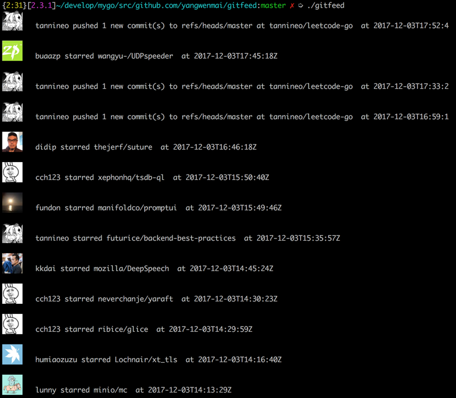

# GitFeed #
[](https://travis-ci.org/yangwenmai/gitfeed) [](https://goreportcard.com/report/github.com/yangwenmai/gitfeed)  [](http://godoc.org/github.com/yangwenmai/gitfeed) [](https://coveralls.io/github/yangwenmai/gitfeed?branch=master) [](https://github.com/yangwenmai/gitfeed/issues) [](https://github.com/yangwenmai/gitfeed/LICENSE) [](https://github.com/yangwenmai/gitfeed/releases)

通过命令行查看你的 Github Newsfeed.

Newsfeed 包括你在 GitHub 上 follow 的人，以及你 watch 的仓库等所有动态。

所有动态你都能够在你的 Github 控制面板上找到。

基于 [Github Events API]( https://developer.github.com/v3/activity/events/#list-public-events-that-a-user-has-received)

**列出一个用户接收到的事件**

你能接收到你 follow 的人，以及 watch 项目的动态事件。
如果用户授权了，你还可以看到私有事件，否则你只能看到公开的时间。

## 功能截屏 ##



## 安装 ##

1. `go get github.com/yangwenmai/gitfeed`.

2. 源码安装

    - `git clone https://github.com/yangwenmai/gitfeed.git`
    - `go build && ./gitfeed`

## 用法 ##

用 `gitfeed` 来运行。

第一次你运行 `gitfeed`, 它将询问你的 Github 用户名，然后会把它当做你获取 Github 用户动态的默认用户。

你也能够指定其他 Github 用户名，来获取他们的公开动态。

命令参数:

```shell
NAME:
   gitfeed - Check GitHub Newsfeed.

USAGE:
   gitfeed [global options] command [command options] [arguments...]

VERSION:
   0.0.1

AUTHOR:
   maiyang

COMMANDS:
     help, h  Shows a list of commands or help for one command

GLOBAL OPTIONS:
   --config FILE, -c FILE  Load configuration from FILE (default:~/.gitfeed/gitfeed.ini)
   --user value, -u value  Github username
   --help, -h              show help
   --version, -v           print the version
```

你能够在 `~/.gitfeed/gitfeed.ini` 修改默认配置。

